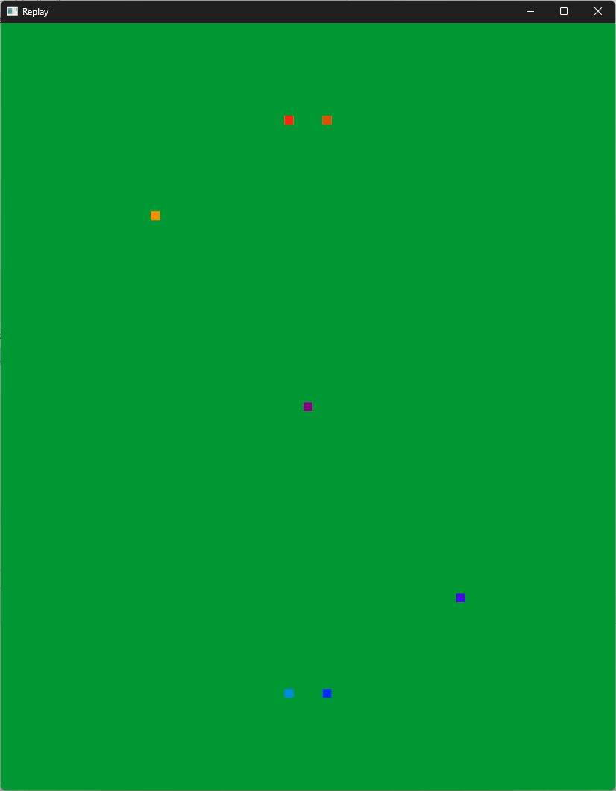

# Visualize Rocket League Replays from a 2D Top-down View

```
Usage: rl-replay-zone-visualizer [OPTIONS] --replay <REPLAY>

Options:
  -r, --replay <REPLAY>    Path to replay file to visualize
  -u, --ups <UPS>          Count of network frames to process per second. Defaults to 120, which is the same speed a RL server will process a game
  -d, --display <DISPLAY>  What kind of display to show, whether it's points to show a point for each player, or voronoi to show a voronoi diagram [default: points] [possible values: points, voronoi]
  -h, --help               Print help
  -V, --version            Print version

```

### Points Visualization


### Voronoi Visualization
